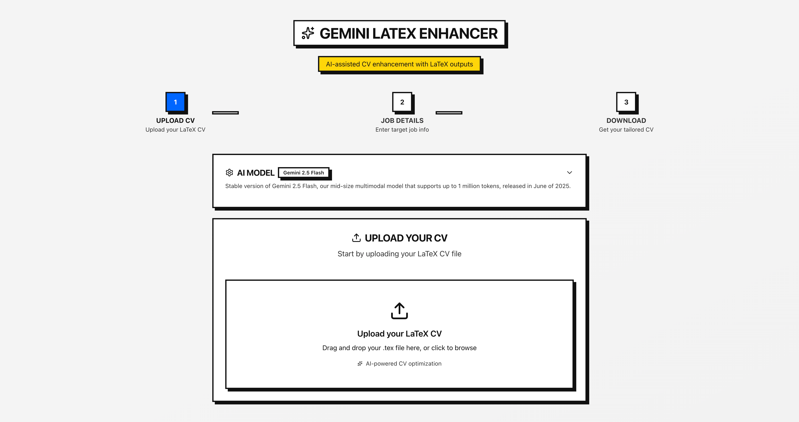
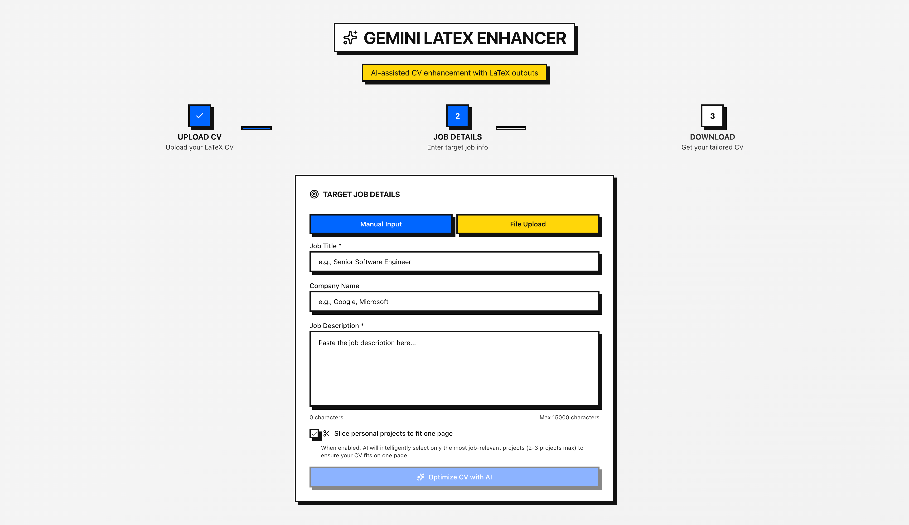
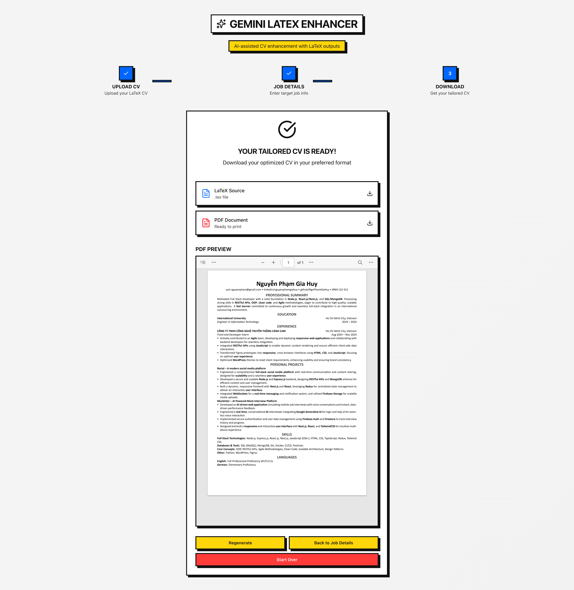

# Gemini LaTeX Enhancer – AI‑assisted CV enhancement with LaTeX outputs

[](https://www.typescriptlang.org/)
[](https://nextjs.org/)
[](https://react.dev/)
[](https://fastapi.tiangolo.com/)
[](https://www.python.org/)
[](./LICENSE)

## 📝 Description

Gemini LaTeX Enhancer streamlines the grind of tailoring a CV to a job description and producing clean, reusable LaTeX outputs. It pairs a modern Next.js frontend with a FastAPI backend and a set of focused services (AI prompts, file handling, validation, batch processing, LaTeX compilation). Professionals and students who frequently adapt their CVs benefit from consistent, AI‑assisted results that compile to PDF and are easy to version.

Instead of jumping between editors, prompt drafts, and LaTeX compilers, the app provides an end‑to‑end, guided flow: upload your resume, provide job details, select an AI model, analyze alignment, and download production‑ready LaTeX (and PDFs when available). The workflow reduces typical manual effort and removes context switching.

## ✨ Features

-   **Guided multi‑step CV enhancement flow**: Upload → Job details → Model selection → AI analysis → Align → Download. Saves time otherwise lost switching between tools.
-   **AI‑assisted analysis and alignment**: Dedicated prompts and services surface gaps and tailor content toward the role, reducing manual rewriting.
-   **Clean LaTeX outputs and optional PDFs**: LaTeX validation and `lualatex` compilation yield consistent artifacts suitable for long‑term maintenance.
-   **Batch processing via CSV**: Enhance a CV across many roles in one run, with progress tracking and a zipped result set — replacing repetitive per‑job edits.
-   **Robust file handling**: Upload validation, secure saving, and cleanup services minimize common errors and leftover artifacts.
-   **Progress visibility**: Backend progress endpoints and frontend hooks reduce uncertainty during longer operations.
-   **Model discovery**: Fetch available Google Gemini models (with fallback) and choose the default or an override.


## 🖼️ Demo / Screenshots

The following screenshots demonstrate the complete CV enhancement workflow:

### 1. Upload CV

<center><em>Upload your LaTeX CV file to begin the enhancement process</em></center>

### 2. Job Details

<center><em>Enter job title, company name, and job description for AI analysis</em></center>

### 3. AI Analysis

<center><em>Review AI-powered alignment suggestions and CV enhancement recommendations</em></center>

### 4. Download Results

<center><em>Download enhanced LaTeX files and compiled PDFs for your tailored CV</em></center>

## ⚙️ Installation

This repository contains a Next.js frontend (`frontend/`) and a FastAPI backend (`backend/`). You can run them with the provided cross‑platform dev scripts or manually.

### Prerequisites

-   Node.js and npm (for the Next.js frontend)
-   Python 3.9 (for the FastAPI backend)
-   LaTeX toolchain with `lualatex` available on your PATH (for PDF compilation)

### Quick start (macOS/Linux)

Use the bundled development script to start both services and stream logs.

```bash
# From the repository root
./dev.sh start
```

Useful alternatives:

```bash
./dev.sh status   # Check if frontend/backend are running
./dev.sh logs     # Tail both logs
./dev.sh stop     # Stop both services and clean ports
```

The script will:

-   Create a Python `venv` under `backend/` if missing
-   Install Python packages from `backend/requirements.txt`
-   Install frontend dependencies with `npm install` (if missing)
-   Start FastAPI on port 8000 and Next.js on port 3000

If `GEMINI_API_KEY` is not exported, the backend will still start but AI calls will fail until configured. The backend auto‑loads environment variables from a root `.env` file when present.

### Quick start (Windows PowerShell)

```powershell
# From the repository root
./dev.ps1 start
```

Other commands:

```powershell
./dev.ps1 status   # Show service status
./dev.ps1 stop     # Stop services and clean ports
./dev.ps1 restart  # Restart both services
```

### Manual setup

Backend (FastAPI):

```bash
cd backend
python3 -m venv venv
source venv/bin/activate
pip install -r requirements.txt
uvicorn app.main:app --host 0.0.0.0 --port 8000 --reload
```

Frontend (Next.js):

```bash
cd frontend
npm install
npm run dev
```

Troubleshooting:

-   If Python packages fail to install, ensure Python 3.9 and an active `venv`.
-   If PDF compilation fails, install a TeX distribution providing `lualatex`, or proceed with LaTeX downloads only.
-   If the frontend can’t reach the backend, confirm `API_BASE` (see configuration) and that ports 3000/8000 are free.

## 🚀 Usage

Start the backend and frontend (via scripts or manually), then open the frontend (typically `http://localhost:3000`).

Typical UI flow:

1. Upload your LaTeX CV (`.tex`).
2. Enter job title, company (optional), and job description.
3. Select a model (defaults provided by the backend).
4. Run AI analysis, review suggestions, and align content.
5. Download the enhanced LaTeX and (if compiled) the PDF.

### Before vs After — real workflows

-   **Before**: Reword bullet points per application and reformat LaTeX by hand.

    -   **After**: Guided alignment and validated LaTeX generation reduce typical manual editing.

-   **Before**: Repeatedly copy‑paste job descriptions and track progress in spreadsheets.

    -   **After**: Batch CSV processing with progress endpoints consolidates multi‑role tailoring in one run.

-   **Before**: Manually compile LaTeX and clean up `.aux`/`.log` artifacts.
    -   **After**: Backend compilation and cleanup automate repetitive build steps when PDF generation is viable.

### API examples (for advanced users)

Base URL defaults to `http://localhost:8000`.

Upload a LaTeX CV:

```bash
curl -X POST \
  -F "file=@/path/to/your_cv.tex" \
  -F "model_id=gemini-2.5-flash" \
  http://localhost:8000/api/upload
```

Enhance for a specific job:

```bash
curl -X POST http://localhost:8000/api/enhance \
  -F "session_id=<uuid-from-upload>" \
  -F "job_title=Software Engineer" \
  -F "job_description=$(cat ./jd.txt)" \
  -F "company_name=Acme" \
  -F "latex_content=$(cat ./your_cv.tex)" \
  -F "slice_projects=false"
```

Batch enhance with CSV:

```bash
curl -X POST http://localhost:8000/api/enhance/batch \
  -F "session_id=<uuid>" \
  -F "latex_content=$(cat ./your_cv.tex)" \
  -F "csv_file=@./jobs.csv"
```

Check progress:

```bash
curl "http://localhost:8000/api/progress?session_id=<uuid>"
```

Download artifacts:

```bash
# Backend also serves /outputs statically; this endpoint forces a download
curl -O http://localhost:8000/api/download/<filename.tex>
curl -O http://localhost:8000/api/download/<filename.pdf>
```

Discover models:

```bash
curl http://localhost:8000/api/models
curl http://localhost:8000/api/models/default
```

## 🔧 Configuration

Backend configuration lives in `backend/app/config.py` and loads environment variables from a root `.env` file when present.

Environment variables:

```bash
# Required for AI features
GEMINI_API_KEY=your_google_gemini_api_key

# Optional
AI_MODEL=gemini-2.5-flash
USE_ADVANCED_PROMPT=true
```

Frontend API base URL:

-   `frontend/src/lib/api.ts` uses `NEXT_PUBLIC_API_BASE` when set, otherwise defaults to `http://localhost:8000`.

```bash
# Example (place in frontend .env.local or export before start)
NEXT_PUBLIC_API_BASE=http://localhost:8000
```

PDF compilation:

-   The backend uses `lualatex` with a configurable timeout (`LATEX_TIMEOUT`, default 30s) and cleans up auxiliary files after compilation.

CORS:

-   Allowed origins default to `http://localhost:3000` and `http://127.0.0.1:3000`.

## 🗂️ Folder structure

```text
.
├─ backend/                     # FastAPI backend
│  ├─ app/
│  │  ├─ main.py               # FastAPI app, routes, CORS, static outputs, health
│  │  ├─ config.py             # Loads .env from repo root; settings & defaults
│  │  ├─ prompts/              # Prompt templates (summarization/enhancement)
│  │  ├─ routes/               # API: upload, enhance(+batch+progress+csv), models, download
│  │  ├─ services/             # AI, LaTeX, files, models cache, progress, output mgmt
│  │  └─ utils/                # Logger, response builder
│  ├─ outputs/                 # Generated LaTeX/PDF artifacts
│  ├─ uploads/                 # Uploaded files (cleaned after processing)
│  └─ requirements.txt         # Backend dependencies
├─ frontend/                    # Next.js 15 + React 19 + TypeScript
│  ├─ src/
│  │  ├─ app/                  # App Router, layout, globals.css
│  │  ├─ components/           # UI + cv-enhancer flow
│  │  ├─ hooks/                # Upload, analysis, progress, model selection
│  │  ├─ lib/                  # API client and utils (API_BASE, builders)
│  │  └─ types/                # Shared TypeScript types
│  ├─ package.json             # Scripts: dev/build/start/lint
│  └─ tsconfig.json
├─ dev.sh                       # macOS/Linux dev script (start/stop/status/logs)
├─ dev.ps1                      # Windows PowerShell dev script
├─ logs/                        # backend.log, frontend.log (dev script output)
└─ LICENSE                      # Project license
```

## 🔌 Dependencies

Backend (`backend/requirements.txt`):

-   `fastapi`, `uvicorn[standard]`, `python-multipart`
-   `google-generativeai`, `python-dotenv`, `pydantic`, `pydantic-settings`
-   `aiofiles`, `urllib3`, `black`

Frontend (`frontend/package.json` highlights):

-   `next@15.x`, `react@19`, `react-dom@19`, `typescript@^5`
-   UI libs: `@radix-ui/*`, `lucide-react`, `sonner`
-   Styling/utilities: `tailwindcss@^4`, `tailwind-merge`, `clsx`, `class-variance-authority`

## 🧭 Architecture & flow

-   The FastAPI app (`app.main:app`) mounts routes under `/api` and serves `outputs/` statically under `/outputs`.
-   `AIService` centralizes Google Gemini calls for summarization and CV enhancement, using prompts from `app.prompts`.
-   `LatexService` validates LaTeX and compiles to PDF via `lualatex`, cleaning aux files post‑build.
-   `ModelService` discovers available models (with in‑memory caching and fallbacks) and provides defaults.
-   `ProgressService` tracks batch job progress in memory; `/api/progress` exposes current state.
-   The Next.js frontend orchestrates steps through components in `src/components/cv-enhancer/` and calls backend APIs from `src/lib/api.ts`.

## 🤝 Contributing

1. Create a feature branch from `main`.
2. Run the full stack locally (`./dev.sh start` or `./dev.ps1 start`).
3. Keep edits focused; include tests if you add testable utilities and update documentation as needed.
4. Open a pull request describing the problem, approach, and any UI changes (with screenshots where helpful).

## 📄 License

This project is licensed — see [`LICENSE`](./LICENSE) for details.

## 👤 Author

| Name          | GitHub                                             | LinkedIn                                                             |
| ------------- | -------------------------------------------------- | -------------------------------------------------------------------- |
| NgnPhamGiaHuy | [@NgnPhamGiaHuy](https://github.com/NgnPhamGiaHuy) | [Nguyen Pham Gia Huy](https://www.linkedin.com/in/nguyenphamgiahuy/) |

## 🙏 Acknowledgements

-   Thanks to the FastAPI and Next.js ecosystems for developer‑friendly foundations.
-   Appreciation for open‑source UI patterns and component libraries that inspire the structure in `frontend/src/components/ui/`.
-   Gratitude to the wider LaTeX and AI communities whose tools and guidance inform this project.
